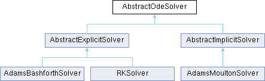

# PCSC-Solving-ODE 
Project for the *Programming concepts in scientific computing* (MATH-458) course.

This project implements different numerical methods to solve ordinary differential equations with generic non linear functions f(y,t):   
 <p align="center">
  y'(t) = f(y,t) with y(t0)=y0
 </p>

  Theses methods are divided into two categories: 
* implicit methods: Adams Moulton solver.
* explicit methods:  Adams Bashforth solver and Runge Kutta solver.  

All these methods return the numerical solution of the ODE. 

The implemented classes are described in the following diagram: 
<p align="center">
  
  
</p>

## Prerequisites:
* `C++17`
* `Doxygen`
* `GoogleTest`

## Installation

Clone the repo:
```
git clone https://github.com/Aurenore/pcsc-project2.git
cd pcsc-project2
```

Install *googletest*
```
git submodule update --init 
```

## Build CMake project:
```
mkdir build
cd build
cmake ..
make
```
## Create Doxygen documentation
Install Doxygen: https://www.doxygen.nl/manual/install.html
```
mkdir doc
cd doc
doxygen
```

To view documentation: LIEN HTML

## Usage
### Command line arguments
The user can provide different options:
* `--solver`: to specify the method used to find the solution of the ODE: Moulton, Bashforth or Runge Kutta
* `--h`: step size 
* `--t0`: initial time
* `--t1`: final time
* `--y0`: initial value
* `--order`: order of the method: [0,4] for Adams Moulton Solver, [1,5] for Adams Bashforth Solver and [1,4] for the Runge Kutta Solver
* `--choice`: Choice is the number assoicated to the function the user wants to use so 1, 2 or 3 where:
   1. f(y,t) = 1+t
   2. f(y,t) = -100*y
   3. f(y,t) = sint(t)*cos(t)
   

As an example the following command will solve the ODE associated to function number 2 (f(y,t)=-100*y) using the Runge Kutta solver of order 3. The initial time is set to 0 and the final time to 100. The step size used is 0.001 and the initial guess is 1:  
  `./main_solver RK 0.001 0. 100. 1. 3 2`

### Output
The time and the numerical solution at each time steps can be found in the 'cmake-build-debug/solution_file.dat'

## Flow of the program
1. The user sets the input arguments: ex: `RK 0.001 0. 100. 1. 3 2`
2. Construction of the appropriate solver method
3. Ode solved using the solver specified by the user
4. The results are written at each time step in the file `solution_file.dat`.

## List of features
* Changable numerical methods to solve ODE
* Changable initial conditions for which to solve the ODE: *t0, t1, y0 and h*
* Easy addition of new functions for which to solve the ODE
* If the input arguments are unvalid, the user is asked to give arguments one by one in the terminal. 

## Tests
GoogleTest library was used.
The tests can be found in `test/test_solver.cc` file.  
To run the tests: `./test_solver`


Three function fRhs1, fRhs2 and fRhs3 are used to check the accuracy of the solvers. The exact solutions for these three functions are known: sol1, sol2, sol3.

* `GetFinalTime`,`GetInitialTime`,`GetStepSize`,`GetInitialValue`,`GetOrder`: check that the value of the initial parameters (*t1, t0, h, y0, order*) returned by the corresponding  function Get corresponds to the one defined with the corresponding Set functions. Performed for all solvers.

* `second_Constructor` : checks the constructor of a solver. Performed for all solvers.
* `B_sum_order1`: checks that for each order the b values sum up to 1. This check is performed for all solvers.
* `ScalarProduct`: checks the scalar product function. This check is performed for all solvers.
* `EulerBackward_fRhs1`: checks that the result of the Euler backward method, so the Adams Moulton solver for order 0 and for fRhs1, corresponds to the    one of sol1. This check is also performed for fRhs2 and fRhs3: `EulerBackward_fRhs2` and `EulerBackward_fRhs3`
* `EulerForward_fRhs1`: checks that the result of the Euler forward method, so the Adams Bashforth or the Runge Kutta solver for order 1 and for fRhs1, corresponds to the one of sol1. This check is also performed for fRhs2 and fRhs3: `EulerForward_fRhs2` and `EulerForward_fRhs3`
* `orders_and_fRhs`: checks for each order and for each function  that the final result is equal to the one of the solution. The orders checked are between 1 and 4 for Adams Moulton, 2 and 5 for Adams Bashforth and 2 and 4 for Runge Kutta
* `EulerForward_compared_to_Adamsbashforth_fRhs1`: checks that each line of the results of the Adamsbashforth solver and the result of the Runge Kutta result are equal for order equal to 1 and for fRhs1. This check is also performed for fRhs2 and fRhs3. Each line should be equal as both solvers are the Euler Forward method.
* `ProductWithA`: checks if $\sum_{i=0} a[j][i] = c_j$ for $j = 1, \dots, s$, i.e. if each row $j$ of a sums to the corresponding coefficient $c_j$. This condition should be verified for each order of the Runge-Kutta method. The sum is computed via the function `GetA`.
* `sum_of_A_is_C`: checks that the result of `ProductWithA` returns the scalar product of a vector with the jth row of a. To this end, it computes the scalar product of the jth row of a with the all-ones vector. This should be equal to $c_j$.

## Issues and perspective
* The first limitation of the program is that the number of functions fRhs proposed to the user is very limited. One should implement method which translates a string - specified by the user -  into a mathematical expression. Then, any function could be used. 
* The second limitation of the program is for implicit methods which use the Newton method. If the maximum number of iteration is reached and the Newton method didn't converge then it would have been smart to implement another method like the bisection one for example. 
* Another limitation is that we can not check the result for all right hand side functions, if we do not know the corresponding solution. The convergence depends on parameters such as t1, h and y0. If the final result is far from the unknown true result, there is no way to verify it.  
* More options could be added concerning the format of the output. For example, a graph ploting the solution with respect to time would be a good visualization of the result. 
* Other methods could be implemented, like the Backward Differentiation Formulas (BDF).


## Credits
Thanks to rpopescu for providing some templates for the abstract ODE solver and exception classes. 
